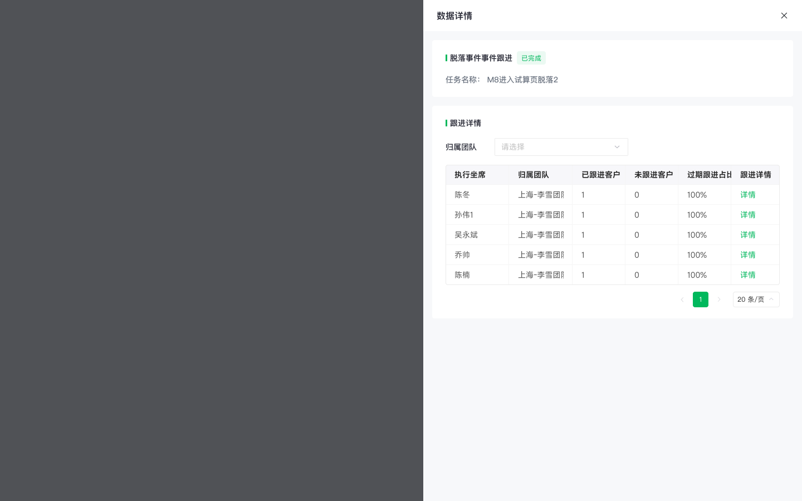
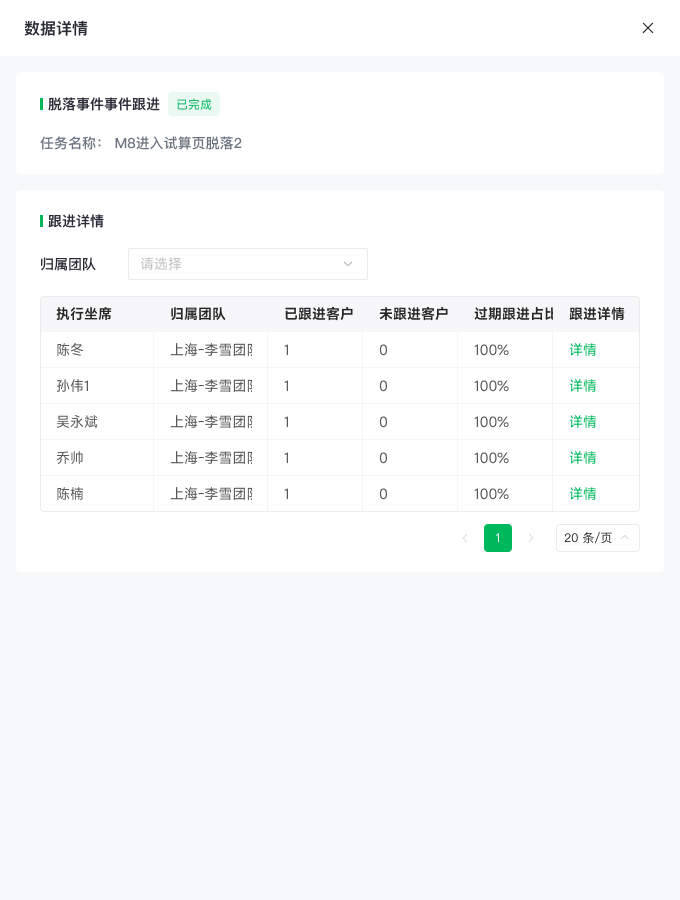

# Qifu Drawer Form

奇富科技中后台 Figma 抽屉表单生成 Skill。根据业务描述、字段清单、截图或线框，调用「奇富科技中后台组件库 新」中的真实组件，生成可编辑、可验收、保持组件实例关系的右侧抽屉。

本仓库延续 [qifu-list-page](https://github.com/BitPan666/qifu-list-page) 的提示词结构与交付方式，并增加数据详情抽屉 Golden Sample、内嵌表格、分页器、文本样式和结构 QA 规则。

> 仓库公开发布只降低 Skill 获取门槛，不会携带 Figma 登录状态、组件库权限或真实组件实例。默认使用 `REAL_COMPONENT_ONLY`；没有正式组件库权限时，请先准备 Portable Kit 并显式使用 `PORTABLE_KIT`。

## 效果预览

### 数据详情抽屉 Golden Sample



### 680px 抽屉局部



对应 Figma 验证节点：[Golden Sample / Drawer / 数据详情 / 680](https://www.figma.com/design/gTV3VdC6a5e9vpkRHIZSXA/奇富科技中后台组件库-新?node-id=4725-1548)。

## 包含内容

```text
.
├── AGENTS.md
├── README.md
├── screenshots/
│   ├── data-detail-drawer-680.png
│   └── data-detail-golden-sample-full.png
└── skills/
    └── qifu-drawer-form/
        ├── SKILL.md
        ├── VERSION
        ├── agents/openai.yaml
        ├── scripts/validate_portable_manifest.py
        └── references/
            ├── component-map.md
            ├── drawer-compositions.md
            ├── field-control-map.md
            ├── figma-execution-validation.md
            ├── golden-sample-data-detail-drawer.md
            ├── page-blueprint.md
            ├── platform-theme-switching.md
            ├── platform-yushu.md
            ├── portable-kit.md
            ├── portable-component-manifest.json
            └── zhikexing-list-background.md
```

## 支持的抽屉组合

| 组合名称 | 适用场景 | 默认宽度 |
| --- | --- | ---: |
| `Qifu Drawer Form / Simple Create` | 少量字段、无分组的新建任务 | 480px |
| `Qifu Drawer Form / Sectioned Create` | 多分区标准新建表单 | 640px |
| `Qifu Drawer Form / Advanced Create` | 字段多、双列或多步骤创建 | 840px |
| `Qifu Drawer Form / Edit` | 已有记录编辑与回填 | 640 / 840px |
| `Qifu Drawer Form / Readonly` | 只读查看 | 480 / 640px |
| `Qifu Drawer Form / Data Detail with Table` | 摘要、筛选、表格与分页 | 680px |

## 使用前提

- 使用支持 Figma Connector / `use_figma` 的 Codex；
- 在 Codex 中完成个人 Figma 账号连接；
- 对目标业务文件拥有编辑权限；
- 对「奇富科技中后台组件库 新」拥有访问权；
- 跨文件生成时，目标文件能够使用组件库中已发布的组件。

GitHub 只同步 Skill 文件，不会同步 Figma 登录状态、访问权限、Token 或个人凭证。

## 组件来源模式

| 模式 | 组件来源 | 缺失时行为 | 适用场景 |
| --- | --- | --- | --- |
| `REAL_COMPONENT_ONLY`（默认） | 当前文件已启用的正式 Figma Library | 立即停止，返回 `COMPONENT_LIBRARY_UNAVAILABLE` | 正式交付 |
| `PORTABLE_KIT` | 当前文件内复制的本地组件 | 立即停止，返回 `PORTABLE_COMPONENT_MISSING` | 没有正式 Library 权限 |
| `VISUAL_FALLBACK` | 页面级视觉降级 | 允许生成，但必须标记 `Fallback /` 并审计 | 只需要截图预览 |

未显式指定模式时，Skill 不会因为导入失败而静默生成假组件。

## 平台与主题切换

平台和主题必须分开写：`platformKey` 管平台壳、菜单、业务词和底图；`themeKey` / `themePrimary` 只管主按钮、选中态、链接色、轻量标签和强调色。换蓝色主题时不复制组件库、不改字段结构、不 detach 实例手工改色。

| platformKey | 平台 | 默认主题 | 用法 |
| --- | --- | --- | --- |
| `zhikexing` | 智客星 | `zhikexing-green` | 当前主平台；可生成独立抽屉，也可叠加到智客星列表页底图。 |
| `yushu` | 毓数 | `yushu-green` | 只有明确写毓数时才使用，不再作为默认平台。 |
| `zhineng-yunying` | 智能运营平台 | `smartops-blue` | 预留的蓝色主题平台；平台壳未补齐时先生成独立抽屉并记录缺口。 |
| `qifu-generic` | 奇富通用后台 | `zhikexing-green` | 未指定平台时使用，只生成抽屉本体。 |

| themeKey | 主色 | 说明 |
| --- | --- | --- |
| `zhikexing-green` | `#00B578` | 智客星默认绿色主题。 |
| `yushu-green` | `#00B578` | 毓数当前绿色主题，以目标文件变量为准。 |
| `smartops-blue` | `#1677FF` | 智能运营平台蓝色主题。 |
| `custom` | 用户指定 | 必须同时写 `themePrimary`。 |

完整规则见 [`platform-theme-switching.md`](skills/qifu-drawer-form/references/platform-theme-switching.md)。

### Portable Kit 的准备与使用

1. 从组件库源文件复制一份副本，命名为 `奇富科技中后台组件库 - Portable Kit`；
2. 删除不需要分享的业务页面，保留组件集、Variants、嵌套组件、文字样式和变量；
3. 允许协作者复制该文件到自己的 Draft；
4. 最稳定的方式是在 Portable Kit 副本中直接生成业务页面；
5. 如果要在已有业务文件中生成，先把 Portable Kit 的本地主组件复制到业务文件；
6. 提示词中明确写 `componentMode: PORTABLE_KIT`；
7. Skill 会按 `references/portable-component-manifest.json` 的精确名称检查本地组件，并验证 `INSTANCE.mainComponent`。

Portable Kit 不依赖原始 Library 的 published key，也不会接收原组件库更新。完整规则见 [`references/portable-kit.md`](skills/qifu-drawer-form/references/portable-kit.md)。

## 使用方式一：直接打开仓库

```bash
git clone https://github.com/jingjingtu/qifu-drawer-form.git
cd qifu-drawer-form
```

使用 Codex 打开仓库目录，然后在提示词中明确写：

```text
使用 qifu-drawer-form Skill，并调用 @figma 插件，在指定 Figma 文件生成右侧抽屉……
```

这种方式会同时读取仓库中的 `AGENTS.md`，适合团队协作和持续更新。

## 使用方式二：安装到个人 Skills

```bash
mkdir -p ~/.codex/skills
cp -R skills/qifu-drawer-form ~/.codex/skills/
```

安装完成后重新开启一个 Codex 任务，使 Skill 被重新发现。

## 提示词结构

复制下面模板，只替换 `【】` 中的业务内容。组件精确名称、Slot 组装、间距、文本样式和 QA 已写入 Skill，无需在提示词中重复。

```text
使用 qifu-drawer-form Skill，并调用 @figma 插件，在【Figma 地址】的【目标 Page】生成【抽屉名称】。

平台：【智客星 / 毓数 / 智能运营平台 / 奇富通用后台】；platformKey：【zhikexing / yushu / zhineng-yunying / qifu-generic】。

主题：【zhikexing-green / yushu-green / smartops-blue / custom】；themePrimary：【不填使用主题默认 / #1677FF / 自定义色值】。

操作类型：【新建 / 编辑 / 查看】；业务对象：【对象名称】；抽屉标题：【标题文案】。

抽屉组合：【不填自动判断 / Qifu Drawer Form / Simple Create / Sectioned Create / Advanced Create / Edit / Readonly / Data Detail with Table】；宽度：【不填自动判断 / 480 / 640 / 680 / 840】。

分区一：【分区名称】
- 【字段标签】，控件【Input / Select / Radio.Group / Checkbox / Switch / DatePicker / DateRange / Cascader / Textarea / Upload / Custom】，是否必填【是 / 否】，默认值【无 / 内容】，帮助文字【无 / 内容】

分区二：【分区名称】
- 【字段标签】，控件【控件类型】，是否必填【是 / 否】，默认值【无 / 内容】

状态：【Data / Loading / Disabled / Error，不填默认 Data】。

Footer：取消按钮【显示 / 隐藏】；主操作【确定 / 保存 / 关闭 / 自定义文案】；危险操作【无 / 文案与确认提示】。

如包含内嵌表格：
- 摘要标题：【文案】；状态标签：【文案与状态】；摘要正文：【文案】
- 筛选控件：【标签、控件与默认值】
- 表格列：【列名与列宽要求】
- 示例数据：【完整数据行】
- 分页：【总数、每页条数、当前页】

不要覆盖已有画板；使用真实组件实例。完成后检查组件关系、Auto Layout、整数几何、文本样式、平台与主题回读、文字截断、节点重叠和画板溢出，并返回节点 ID 与截图结果。
```

未指定正式交付 Page 的试生成、效果验证和 Skill 回归画板，统一放入组件库 Figma Page `测试`（node `3497:651`）。未指定平台时使用 `qifu-generic`，只生成抽屉本体，不默认套用毓数。


## 提示词示例一：智客星超频流控配置

```text
使用 qifu-drawer-form Skill，并调用 @figma 插件，在【Figma 地址】的当前 Page 生成“超频流控配置”右侧抽屉。

平台：智客星；platformKey：zhikexing。
主题：zhikexing-green。
presentationMode：STANDALONE。
componentMode：REAL_COMPONENT_ONLY。

操作类型：新建；业务对象：超频流控规则；抽屉标题：超频流控配置。
抽屉组合：Qifu Drawer Form / Simple Create；宽度：840。

分区一：基础信息
- 规则名称，控件 Select，必填，是，placeholder：请选择，宽度 FULL
- 超频人群，控件 Radio.Group，必填，是，选项：人群包、客群，默认值：人群包
- 选择人群，控件 Custom(SelectedAudienceTag)，必填，否，展示已选人群标签：26年企微活动 - 3K-2W新客250721 - 3K-2W新客250721 S102180
- 有效期，控件 DateRange，必填，是，placeholder：开始日期 至 结束日期，宽度 408
- 触达方式，控件 Select，必填，是，placeholder：请选择，宽度 FULL
- 超频规则，控件 Custom(OverFrequencyRuleBuilder)，必填，是；规则块包含策略类型 Select，以及两行“每 InputNumber 天，触达 InputNumber 条”，第一行只有添加按钮，第二行有添加和删除按钮

Footer：取消按钮显示；主操作：确定。

参考截图只用于识别结构和比例，不要把截图放进最终画板。所有 Input、Select、Radio、DateRange、Button、Close 都必须使用真实组件实例。完成后返回 platformKey/themeKey 回读、ComponentResolutionManifest、Slot 验证、structuralValidation 和 visualValidation。
```

## 提示词示例二：蓝色主题智能运营平台

```text
使用 qifu-drawer-form Skill，并调用 @figma 插件，在【Figma 地址】的当前 Page 生成“超频流控配置”右侧抽屉。

平台：智能运营平台；platformKey：zhineng-yunying；platformName：智能运营平台。
主题：smartops-blue；themePrimary：#1677FF。
presentationMode：STANDALONE。
componentMode：REAL_COMPONENT_ONLY。

操作类型：新建；业务对象：超频流控规则；抽屉标题：超频流控配置。
抽屉组合：Qifu Drawer Form / Simple Create；宽度：840。

字段与“智客星超频流控配置”示例保持一致，只允许把主按钮、Radio 选中态、链接色、轻量标签和强调色切换为蓝色主题。不得改变字段顺序、控件类型、间距、圆角、阴影、Slot 结构或 Footer 按钮顺序。

如果目标文件没有智能运营平台专属导航壳，先生成独立抽屉，并在组件缺口中记录 PLATFORM_PROFILE_MISSING；不要借用毓数菜单冒充智能运营平台。
```

## 提示词示例三：数据详情抽屉

```text
使用 qifu-drawer-form Skill，并调用 @figma 插件，在【https://www.figma.com/design/gTV3VdC6a5e9vpkRHIZSXA/奇富科技中后台组件库-新?node-id=3932-405】的当前 Page 生成“数据详情抽屉”。

平台：智客星；platformKey：zhikexing。
主题：zhikexing-green。
操作类型：查看；业务对象：脱落事件跟进；抽屉标题：数据详情。

抽屉组合：Qifu Drawer Form / Data Detail with Table；宽度：680。

摘要标题：脱落事件事件跟进；状态标签：已完成，success light medium square；摘要正文：任务名称：M8进入试算页脱落2。

跟进详情：筛选标签“归属团队”，使用 Single、LG、Default 的 Select，默认值为空。

表格使用 small 36px、bordered、selection off，表头关闭筛选和排序图标。
表格列：执行坐席、归属团队、已跟进客户、未跟进客户、过期跟进占比、跟进详情。

示例数据：
- 陈冬，上海-李雪团队，1，0，100%，详情
- 孙伟1，上海-李雪团队，1，0，100%，详情
- 吴永斌，上海-李雪团队，1，0，100%，详情
- 乔帅，上海-李雪团队，1，0，100%，详情
- 陈楠，上海-李雪团队，1，0，100%，详情

分页：当前第 1 页，每页 20 条。表格四边框只包围表头和数据行，分页器在边框外。

内容卡片和表格边框圆角均为 4px；页面级正文与 Form label 使用 Body/Regular 14/22；表格正文通过 Text-V2 组件母版继承 Body/Regular。标题、表头和链接保持各自语义样式。

不要分离组件实例，不要覆盖人工 Golden Sample。完成后检查 5×6 内容完整、六列总宽 600px、整数几何、Text Style、组件关系和截图效果。
```

## Golden Sample 验收重点

- 抽屉宽度 680px，Header 高度 56px；
- Body 内容安全边距 16px；
- 内容卡片上下 20px、左右 24px，圆角 4px；
- 标题使用 3×12 品牌色 rail，rail 与标题间距 5px；
- 页面级正文和 Form label 使用 `Body/Regular` 14/22；
- 表格正文从 `Text-V2` 组件母版继承 `Body/Regular`，表头保持 Semibold；
- Table Border 为独立 Frame：圆角 4、1px Inside、Clip content；
- 表格外框只包含表头和数据行，Pagination 位于外框之外；
- 表头与数据行逐列同宽，总宽精确闭合；
- 页面级结构使用 Auto Layout，坐标、尺寸、间距和圆角均为整数；
- 保留真实组件实例关系，不用截图冒充可编辑页面。

## 更新

维护者推送更新后，在仓库中执行：

```bash
git pull
```

不要提交 Figma Access Token、GitHub Token、Cookie、密码、真实业务数据或其他个人凭证。
