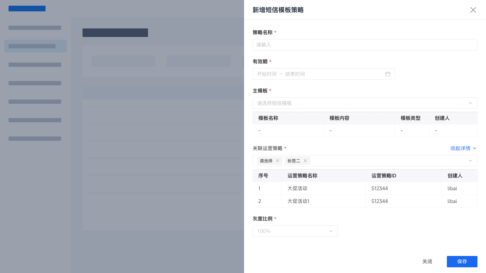
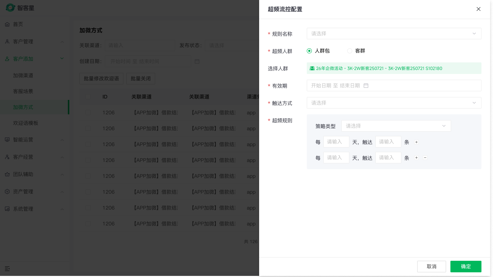

# qifu-drawer-form

在 Figma 中生成可继续编辑的奇富后台右侧抽屉，复用真实组件实例，不把控件画成分散的矩形和文字。

本 README 只展示两个已确认的视觉与结构目标案例：**智能运营平台的“新增短信模板策略”**和**智客星的“超频流控配置”**。它们不是无人工干预的端到端 `pass` 证明；主仓库中的真实运行成熟度以 `_docs/validation-log.md` 为准。两个案例共用下方同一套提示词模板；其他平台、数据详情和内部路由规则不在这里展开。

## 已确认的目标案例



- [查看 Figma Golden Sample](https://www.figma.com/design/gTV3VdC6a5e9vpkRHIZSXA/%E5%A5%87%E5%AF%8C%E7%A7%91%E6%8A%80%E4%B8%AD%E5%90%8E%E5%8F%B0%E7%BB%84%E4%BB%B6%E5%BA%93-%E6%96%B0?node-id=5066-9446)：`1366 × 768`，包含结构预览底图、蒙层和右侧 `680px` 抽屉。
- 目标组合：策略名称、有效期、主模板 + 模板明细表、关联运营策略 + 多选 Tag + 策略明细表、灰度比例，以及“关闭 / 保存”Footer。
- 结构预览只表达抽屉打开态；未提供已验收的智能运营列表页时，不代表已经完成正式平台底图验收。



- 智客星“超频流控配置”：`1366 × 768` 打开态，包含智客星列表页底图、蒙层和右侧 `640px` 抽屉。
- 目标组合：规则名称、超频人群、选择人群、有效期、触达方式、超频规则灰底面板，以及“取消 / 确定”Footer。
- 截图来自 Figma Golden Sample `手搓精修一版` 的真实打开态，用于说明业务结构与视觉目标；正式 Figma 交付仍需按 Skill 的组件实例和结构化验收执行。

## 安装到个人 Skills

使用者需要已连接自己的 Figma 账号，并拥有目标业务文件和「奇富科技中后台组件库 新」的访问权限。

### Codex

```bash
git clone https://github.com/jingjingtu/qifu-drawer-form.git ~/Documents/qifu-drawer-form
mkdir -p ~/.codex/skills
ln -sfn ~/Documents/qifu-drawer-form/skills/qifu-shared ~/.codex/skills/qifu-shared
ln -sfn ~/Documents/qifu-drawer-form/skills/qifu-drawer-form ~/.codex/skills/qifu-drawer-form
```

### Claude Code

```bash
git clone https://github.com/jingjingtu/qifu-drawer-form.git ~/Documents/qifu-drawer-form
mkdir -p ~/.claude/skills
ln -sfn ~/Documents/qifu-drawer-form/skills/qifu-shared ~/.claude/skills/qifu-shared
ln -sfn ~/Documents/qifu-drawer-form/skills/qifu-drawer-form ~/.claude/skills/qifu-drawer-form
```

完成后新开任务，使用 `$qifu-drawer-form` 或直接说“使用 qifu-drawer-form”。更新时进入 `~/Documents/qifu-drawer-form` 执行 `git pull`；软链不需要重新创建。主仓库维护者也可以把同样的两个软链直接指向 `qifu-skills/skills/` 下的对应目录。

## 多平台对比模式

同一个抽屉需要复用到多个平台时，只描述一次公共字段，再列出目标平台。Skill 会冻结公共结构，在同一个 Figma Page 中生成多个完整打开态；字段、控件、顺序、宽度和 Footer 保持一致，只切换平台 Adapter、背景、导航、平台词和主题变量。

```text
使用 qifu-drawer-form，并调用 @figma 插件，把同一个“新增策略”抽屉生成到智客星、毓数和智能运营平台，放在 <目标 Figma 文件> 的 <目标 Page> 空白处，生成一个多平台对比组。

公共结构：Sectioned Create，宽度 640。
基础信息：策略名称 Input 必填；有效期 DateRange 必填。
策略配置：策略类型 Select 必填；备注 Textarea 选填。
Footer：取消、确定。

平台主题自动采用平台注册默认值；优先使用各平台已验收背景。没有正式智能运营平台背景时允许 STRUCTURE_PREVIEW，并标记 PREVIEW_ONLY。
comparisonLayout：HORIZONTAL。
failurePolicy：ALL_OR_NOTHING。
不要改变不同平台之间的字段、控件、顺序、宽度和 Footer。完成后返回 contentFingerprint、每个平台识别证据和跨平台一致性验证。
```

一次只生成一个平台时继续使用下面的普通模板。批量模式的完整识别、预检、布局和验收规则见 [多平台抽屉批量生成协议](references/multi-platform-batch.md)。

## 一套模板

只复制下面这一套。替换 `<...>` 内的业务值；没有的分区或字段直接删除，不保留占位符。

```text
使用 qifu-drawer-form，并调用 @figma 插件，在 <目标 Figma 文件或节点链接> 的 <目标 Page 画布> 中 <指定落点，例如画布空白处或参考 Frame 右侧空白处> 生成“<新建 / 编辑 / 查看><业务对象>”右侧抽屉。
不要新建 Figma Page；只在上述目标画布内生成。

页面平台：<智能运营平台 / 智客星>。
platformKey：<zhineng-yunying / zhikexing>
themeKey：<smartops-blue / zhikexing-green>
componentMode：REAL_COMPONENT_ONLY
compositionName：Qifu Drawer Form / Sectioned Create
widthTier：640
presentationMode：DRAWER_OPEN_WITH_BACKGROUND
background.source：<AUTO / TEMPLATE / EXISTING_LIST_PAGE / STRUCTURE_PREVIEW>
<使用已有已验收列表页时填写> background.sourceNode：<列表页节点 ID>

分区：
- <分区一，例如基础信息>：<字段标签> <控件> <必填或选填>；<字段标签> <控件> <必填或选填>。
- <分区二，例如策略配置>：<字段标签> <控件> <必填或选填>；<字段标签> <控件> <必填或选填>。

<编辑场景补充> 默认值：<字段标签>=<业务值>。
底部按钮：<关闭 / 取消>、<保存 / 确定>。
```

`目标 Figma 文件 + 目标 Page + 指定落点` 决定生成到哪里；`页面平台 / platformKey / themeKey` 只决定页面壳、业务术语和主题，不能代替 Figma 生成位置。

`background.source=AUTO` 会优先使用已验收列表页；未提供时生成 `1366 × 768` 的结构预览底图 + 蒙层 + 抽屉，不会生成裸抽屉。

普通表单默认 `widthTier：640`；`680` 仅用于数据详情和智能运营策略关联 Golden Sample，复杂双列使用 `840`，多个复合规则区或双列表格使用 `960`。智客星“超频流控配置”固定使用 `640`。

## 两份案例提示词

### 案例一：智能运营平台“新增短信模板策略”

```text
使用 qifu-drawer-form，并调用 @figma 插件，在 <目标 Figma 文件或节点链接> 的 <目标 Page 画布> 中 <指定落点> 生成“新增短信模板策略”右侧抽屉。
不要新建 Figma Page；只在上述目标画布内生成。

页面平台：智能运营平台。
platformKey：zhineng-yunying
themeKey：smartops-blue
themePrimary：#1677FF
componentMode：REAL_COMPONENT_ONLY
compositionName：Qifu Drawer Form / Sectioned Create
widthTier：680
presentationMode：DRAWER_OPEN_WITH_BACKGROUND
background.source：AUTO
使用“智能运营平台策略关联抽屉 Golden Sample”。

分区：
- 基础信息：策略名称 Input 必填；有效期 DateRange 必填。
- 策略配置：主模板 Select 必填；选择后在下方展示模板明细表。关联运营策略 Multiple Select 必填，已选项显示可关闭 Tag；选择后在下方展示策略明细表。灰度比例 Select 必填，选项“10%/30%/50%/100%”，默认值“100%”。

底部按钮：关闭、保存。
```

### 案例二：智客星“超频流控配置”

```text
使用 qifu-drawer-form，并调用 @figma 插件，在 <目标 Figma 文件或节点链接> 的 <目标 Page 画布> 中 <指定落点> 生成“超频流控配置”右侧抽屉。
不要新建 Figma Page；只在上述目标画布内生成。

使用“智客星超频流控配置抽屉 Golden Sample”。
页面平台：智客星。
platformKey：zhikexing
themeKey：zhikexing-green
componentMode：REAL_COMPONENT_ONLY
compositionName：Qifu Drawer Form / Sectioned Create
widthTier：640
presentationMode：DRAWER_OPEN_WITH_BACKGROUND
background.source：TEMPLATE

只生成一个 1366×768 的完整打开态 Scene，内部层级为：
1. Background / 智客星列表页底图
2. Overlay Mask / 蒙层
3. Drawer / 右侧抽屉 / 超频流控配置

字段按以下顺序生成，不要新增其他字段：
1. 规则名称：Select，必填，占位文字“请选择”。
2. 超频人群：Radio.Group，必填，选项“人群包、客群”，默认选中“人群包”。
3. 选择人群：Tag，展示“26年企微活动 - 3K-2W新客250721 - 3K-2W新客250721 S102180”，文字左对齐。
4. 有效期：DateRange，必填，占位文字“开始日期 至 结束日期”，日历图标在组件内部最右侧。
5. 触达方式：Select，必填，占位文字“请选择”。
6. 超频规则：Custom(OverFrequencyRule)，必填，浅灰底 #F5F7FA，面板内边距 top/bottom 16px、left 24px、right 不贴边；策略类型标签与 Select 间距 8px；规则行间距 12px。

超频规则内包含：
- 策略类型 Select，占位“请选择”。
- 第一行：每【Input】天，触达【Input】条，右侧 Icon/basic/plus-square。
- 第二行：每【Input】天，触达【Input】条，右侧 Icon/basic/plus-square 和 Icon/basic/Minus-Square。

验收：必须与“Scene / Drawer / 超频流控配置 / Skill规则回归版”保持一致；Drawer 宽度 640，Header 56，Footer 52，Body padding 24，标签左对齐，控件右边距 24，所有控件和图标使用组件库真实实例，所有页面级文字绑定组件库 Text Style。

底部按钮：取消、确定。
```

## 字段怎么写

提示词按“**字段名 + 控件 + 必填/选填 + 默认值、选项或说明**”描述即可；无需填写 Figma 节点 ID 或组件内部路径。

| 业务字段 | 提示词写法 | Skill 使用的真实组件 |
| --- | --- | --- |
| 短文本 | `策略名称 Input 必填，placeholder“请输入策略名称”` | `Input / Base-V2` |
| 单选下拉 | `灰度比例 Select 必填，选项“10%/30%/50%/100%”` | `Select / Base` |
| 多选下拉 | `关联运营策略 Multiple Select 必填，已选项显示可关闭 Tag` | `Select / Base` 多选 + `Tag / small` |
| 日期范围 | `有效期 DateRange 必填` | `DatePicker / DateRange` |
| 长文本 | `策略说明 Textarea 选填，rows=4` | `Textarea` |
| 选择后展示明细 | `主模板 Select 必填；选择后在下方展示模板明细表` | `Select / Base` + 真实表格组合 |

## Select / Cascader 后缀自动验收

调用者不需要在提示词里重复指定箭头样式。Skill 在生成和最终验收时会自动检查 Scene 内全部 Select 与 Cascader：

- 使用真实 `Icon/basic/Down-small`，尺寸 16×16、rotation=0；
- `SM / MD / LG` 的右边距分别为 8 / 10 / 12px；
- Vector Fill 绑定 `图标颜色/--qifu-icon-color-tertiary`，当前解析色为 `#BABAC2`；
- 同规格、同状态的 Select 与 Cascader 后缀保持一致。

即使视觉色值相同，硬编码 `#BABAC2` 也不会通过结构验收。若组件母版不符合契约，Skill 返回 `COMPONENT_SOURCE_GAP: selector suffix contract`，不会在页面实例层手工补图标或改色。

## 智能运营案例固定规则

- 标题使用 `标题/Large` `18/26`；关闭图标绑定 `qifu-icon-color-secondary`。
- “关联运营策略”标签使用 `Body/Regular` `14/22`；已选项使用可关闭的 `Tag / small`。
- “主模板”和“关联运营策略”都遵循 `Select -> 8px -> 明细表`，高度随表格内容撑开。
- 表格外层不加描边；只对表头加 `INNER_SHADOW`：`0 1 2 0 rgba(0,0,0,0.08)`。
- Footer 的关闭使用文字按钮，保存使用主按钮，两者均不加页面级描边。

完整字段和验收要求见 [智能运营平台策略关联抽屉 Golden Sample](references/golden-sample-smartops-strategy-drawer.md)。

## 输出时应看到什么

完成后，Skill 应返回节点 ID、`platformKey/themeKey` 回读、使用的组合、组件来源、字段清单，以及：

```text
structuralValidation = PASS | BLOCKED | FAIL
visualValidation     = PASS | BLOCKED | FAIL
```

只有两项都是 `PASS` 才能算正式完成。

## 文件导航

- [SKILL.md](SKILL.md)：输入契约、工作流、组件规则和验收清单。
- [智能运营平台策略关联抽屉 Golden Sample](references/golden-sample-smartops-strategy-drawer.md)：完整字段与验收基线。
- [智客星超频流控配置抽屉 Golden Sample](references/golden-sample-zhikexing-overfrequency-drawer.md)：固定字段、640px 宽度、超频规则面板与隔离规则。
- [Figma 执行与结构化验收](references/figma-execution-validation.md)：组件实例、Slot 和属性回读检查。
